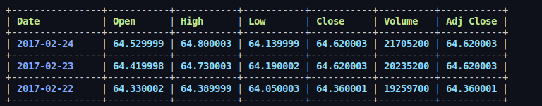

# CSV Reader

Read CSV file provided and display in a tabular format

inspired by [this post from reddit](https://www.reddit.com/r/unixporn/comments/wrcwkz/oc_birthday_tracker_i_dont_know_why_i_made_this/?utm_source=share&utm_medium=web2x&context=3)

Thanks To,
    @ikalnytskyi for [termcolor](https://github.com/ikalnytskyi/termcolor)
    @p-ranav for [tabulate](https://github.com/p-ranav/tabulate)
    @everyone on [StackOverflow](https://www.stackoverflow.com)